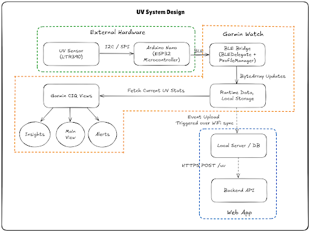

# UV Exposure Tracker — Software Monorepo



> *A complete hardware-to-cloud reference stack that streams live UV-index data from a  
> LTR-390 sensor → Arduino Nano ESP32 (microcontroller) → Garmin smartwatch → web API.*

---

## 1  Overview
This repository contains **all user-space software** for the UV Exposure Tracker:

| Layer | Folder / File | Role |
|-------|---------------|------|
| **External Hardware** | [`UVTest.c`](./UVTest.c) | Bare-metal firmware reading the LTR-390 over I²C/SPI and exposing the instantaneous UV value over Nordic BLE custom services. |
| **Wearable (Watch)** | `ciq_projects/DukeSampleApp/` | Garmin Connect IQ application written in Monkey C that<br>• discovers/pairs with the sensor<br>• displays real-time UV, risk level, graphs & alerts<br>• stores readings locally (FIFO) and POSTs them to a phone/backend when available. |
| **Cloud** | Not included Here | Flask + ngrok endpoint (`POST /api/uv`) that persists and visualises data (see **EnvironmentProfileModel.mc**). |

> **Architecture recap**  
> The diagram above shows three colour-coded domains  
>  **green** = sensor subsystem, **orange** = Garmin watch, **blue** = web backend.  
> 1. The **Arduino Nano ESP32** polls the **LTR-390** every 1 s, broadcasts UV as a single-byte custom characteristic, and exposes a GPIO characteristic for LED/alert feedback.  
> 2. The **Garmin CIQ app** acts as a BLE **bridge**: it subscribes to both characteristics, renders data in the UI (`MainView`, `GraphInsightsView`, …), and persists bursts of readings to `Storage` until a phone tether is present.  
> 3. On every successful CIQ → phone sync event (`PhoneCommunication.mc`), stored readings are JSON-encoded and pushed to `/api/uv`; the backend confirms with `2xx`, upon which the watch clears local storage.

---

## 2  Local Setup

### 2.1 Prerequisites

| Tool | Version | Purpose |
|------|---------|---------|
| **Arduino IDE 2.x** or **PlatformIO** | Board manager for *Arduino Nano ESP32 / Nano 33 BLE* | Build `UVTest.c` |
| **Nordic nRF Command-Line Tools** | (optional) | Low-level flashing / RTT logging |
| **Garmin Connect IQ SDK** | ≥ 6.4 & VS Code Monkey C extension | Build/run `DukeSampleApp` |
| **Java JRE 8 (1.8.0+)** | Required by CIQ SDK |
| **Python 3.9+** & `pip install flask` | Local test server (`/api/uv`) |
| **ngrok** | Expose Flask endpoint to the watch simulator |

### 2.2 Quick-start (all platforms)

```bash
# 1. Clone repo
git clone https://github.com/<you>/uv-exposure-tracker.git
cd uv-exposure-tracker

# 2. Arduino – build & flash
arduino-cli board list        # find your Nano port
arduino-cli compile -b arduino:esp32:nano_esp32 UVTest.c
arduino-cli upload  -b arduino:esp32:nano_esp32 -p /dev/ttyUSB0

# 3. Garmin – open the project in VS Code
code ciq_projects/DukeSampleApp
#   – Ctrl+Shift+P → “Monkey C: Run Without Debugging” → choose *vivoactive5* simulator

# 4. Backend (optional)
cd backend
python app.py                 # starts Flask on localhost:5000
ngrok http 5000               # copy HTTPS URL into DukeSampleApp.mc
